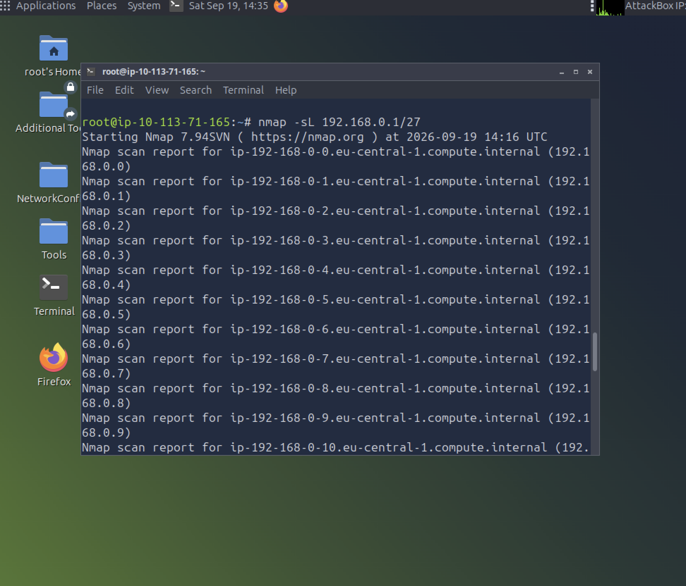
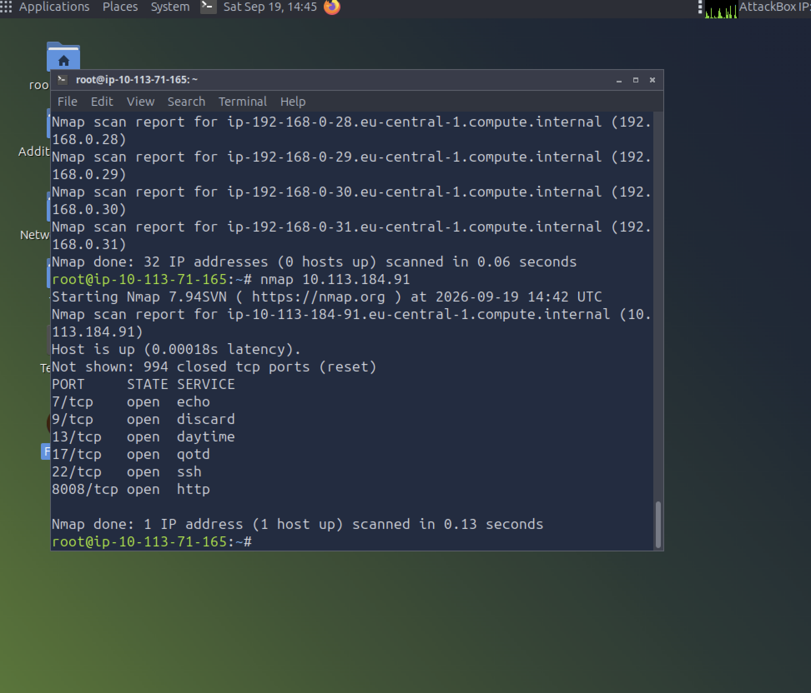
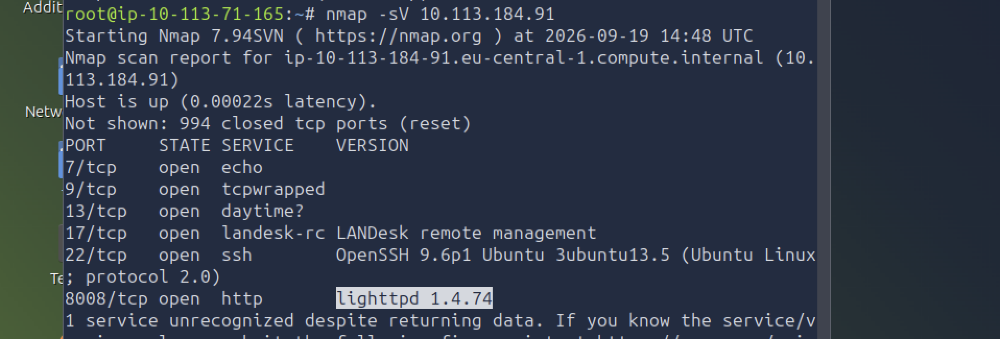

# Nmap: The Basics — TryHackMe

**Path:** Cyber Security 101 → Networking
**Room:** [Nmap: The Basics](https://tryhackme.com/room/nmap)
**Tools:** Nmap 7.94SVN on the TryHackMe AttackBox
**Completed:** September 19, 2026

---

## Overview

This room closes out the Networking module, and it's where the earlier theory (IP addressing, TCP/UDP, protocols) turns into something hands-on. Nmap is usually the first tool you run against a target, so learning to read its output matters more than memorising flags.

I worked through it in three steps, each building on the last:

1. **List the targets** without touching them
2. **Scan a live host** for open ports
3. **Identify the services** running on those ports

---

## 1. Listing targets with `-sL`

Before scanning anything, I wanted to see exactly which addresses a subnet covers. The list scan does this without sending a single packet to the targets. It just works out the range and runs reverse DNS lookups.

```bash
nmap -sL 192.168.0.1/27
```



What stood out:

- A `/27` leaves 5 bits for hosts, so it covers **32 addresses**. Even though I typed `.1`, Nmap started from the network address, so the range runs from `192.168.0.0` to `192.168.0.31`.
- Each address resolved to a hostname like `ip-192-168-0-x.eu-central-1.compute.internal`. That's reverse DNS from the AWS environment the lab runs in, not proof that the hosts exist.
- **"0 hosts up"** isn't a failure. A list scan never checks whether hosts are alive, so there's nothing to mark as up.

It's a handy sanity check to make sure your range is right before you run a real scan.

---

## 2. Default port scan

Next I ran Nmap against the target with no options, to see what the default behaviour gives you.

```bash
nmap 10.113.184.91
```



By default Nmap scans the **1,000 most common TCP ports**. Since I was root on the AttackBox, it used a **SYN scan**: it sends a SYN, reads the reply, and never completes the handshake.

| Port | State | Service (guessed) |
|------|-------|-------------------|
| 7/tcp | open | echo |
| 9/tcp | open | discard |
| 13/tcp | open | daytime |
| 17/tcp | open | qotd |
| 22/tcp | open | ssh |
| 8008/tcp | open | http |

The other **994 ports were closed**, meaning the host replied with a TCP reset. A closed port still tells you the machine is reachable; it just isn't listening there.

The catch is that the **SERVICE** column is only a guess. Nmap looks up the port number in its services file and prints whatever usually runs there. It hasn't actually talked to anything yet.

---

## 3. Service and version detection with `-sV`

To find out what's really running, I added version detection:

```bash
nmap -sV 10.113.184.91
```



This time Nmap connects to each open port and reads the banners and responses:

| Port | Service | Version |
|------|---------|---------|
| 7/tcp | echo | — |
| 9/tcp | tcpwrapped | — |
| 13/tcp | daytime? | — |
| 17/tcp | landesk-rc | LANDesk remote management |
| 22/tcp | ssh | OpenSSH 9.6p1 Ubuntu 3ubuntu13.5 |
| 8008/tcp | http | **lighttpd 1.4.74** |

My notes on the results:

- **Port 8008 runs lighttpd 1.4.74.** An exact version is what lets you search for known vulnerabilities, so this is the most useful line in the scan.
- **SSH reveals Ubuntu**, giving a hint about the OS without running an OS scan.
- **`tcpwrapped`** on port 9 means the connection was accepted and then dropped immediately, usually because of access control.
- **`daytime?`** with a question mark means Nmap isn't confident in the match.
- **Port 17 changed from `qotd` to `landesk-rc`.** `-sV` is far better than a port lookup, but it's still a best guess. On a real engagement I'd confirm by connecting manually with something like `nc`.

In short, **a default scan tells you which doors are open, and `-sV` tells you what's behind them.**

---

## Key takeaways

- `-sL` is free recon: no packets reach the targets, so it's a safe way to check scope.
- Subnet maths matters. `/27` = 32 addresses, aligned to the network boundary.
- Root gets you a SYN scan by default; without privileges Nmap falls back to a full connect scan (`-sT`).
- Closed means the host sent a reset; filtered means something blocked the reply.
- Don't trust service names from a basic scan. Run `-sV`, and verify anything that looks off.

---

