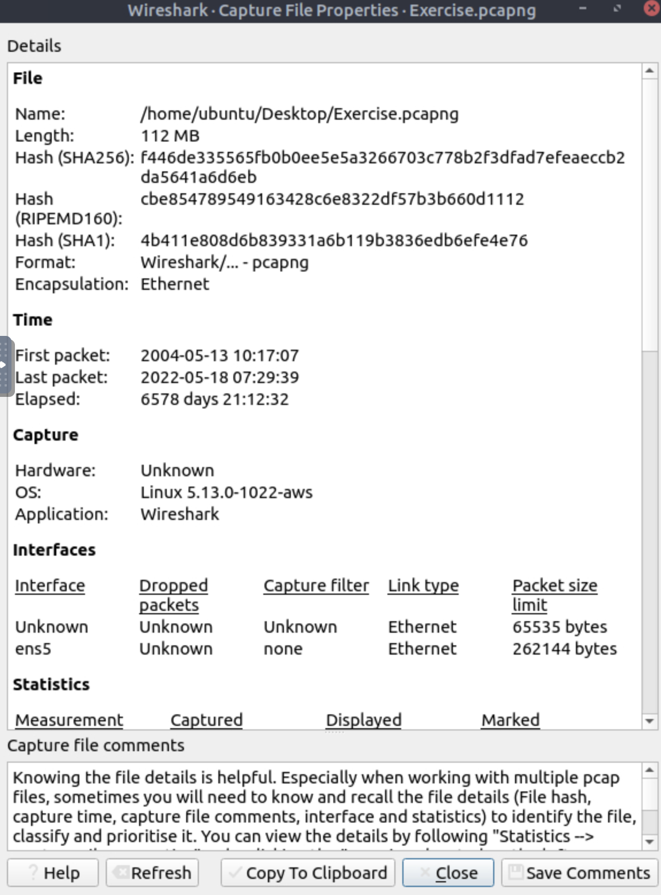
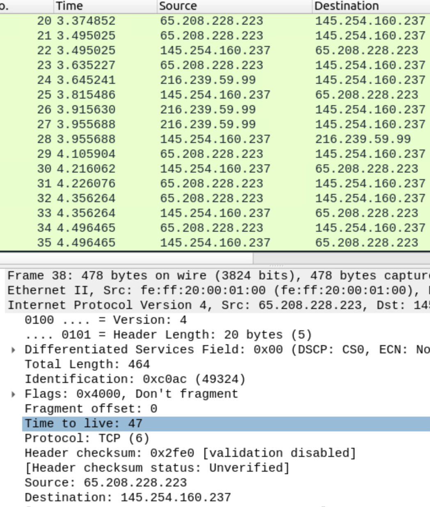
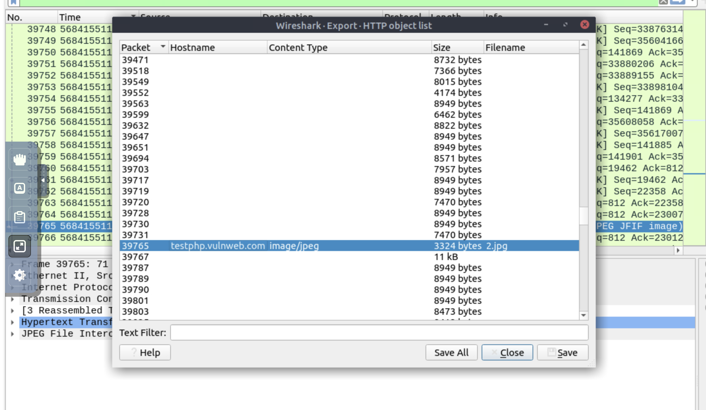
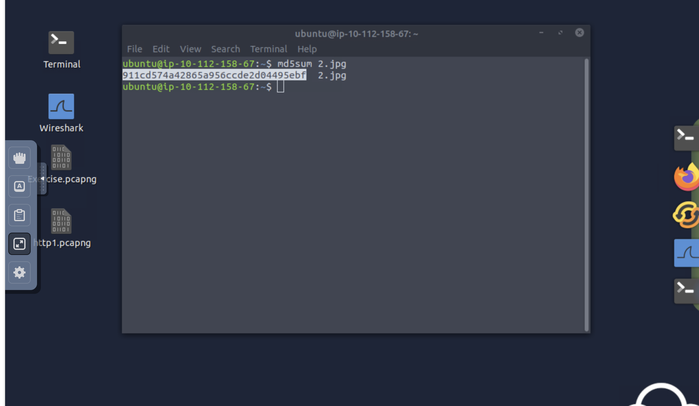

# TryHackMe: Wireshark - Packet Analysis Write-Up

## Overview
This write-up documents my practical analysis of network traffic captures using **Wireshark** as part of the TryHackMe Wireshark module. The primary focus of this lab was moving past basic packet viewing to inspect packet headers, evaluate capture metadata, carve files directly from network streams, and perform integrity checks using Linux CLI tools.

---

## Key Steps & Analysis

### 1. Capture File Metadata Inspection
Before diving into individual packets, I checked the capture file properties to establish baseline forensic details. Inspecting metadata helps quickly identify the capture window, total packet counts, and cryptographic hashes (SHA256, RIPEMD160) for file integrity verification.

* **Verification:** The properties window confirmed the file encapsulation (Ethernet), total size (112 MB), and full SHA256 hash before running queries.

---

### 2. Deep-Dive IP Header Analysis
I analyzed individual packet layers within the Wireshark **Packet Details Pane** to inspect specific protocol headers. Filtering down to target IP traffic allowed for quick verification of transport protocols, Total Length values, and IPv4 **Time to Live (TTL)** fields.

* **Verification:** Expanding *Internet Protocol Version 4* exposed the TTL value (`47`) and confirmed TCP (`6`) as the transport protocol for Frame 38.

---

### 3. File Carving via HTTP Export
Wireshark allows for direct file extraction from unencrypted HTTP streams. Using the **Export HTTP Object List** feature, I parsed the payload stream to isolate transferred web objects, identify their content types (e.g., `image/jpeg`), and save specific artifacts locally for offline triage.

* **Verification:** Located the requested payload file (`2.jpg` from `testphp.vulnweb.com`) in the object list and exported it directly to disk.

---

### 4. Hash Verification & Artifact Triage
After carving artifacts out of the pcap, I dropped into the Linux terminal to calculate cryptographic hashes of the extracted files. Generating MD5 hashes ensures the extracted payload matches known signatures or can be cross-referenced with threat intelligence platforms.

* **Verification:** Executed `md5sum 2.jpg` in the terminal, returning the hash `911cd574a42865a956cde2d04495ebf` to confirm a successful extraction.

---

## Core Takeaways
* **Metadata First:** Always check pcap properties first to verify hashes, frame counts, and time ranges before running complex display filters.
* **Header Inspection:** Understanding IP/TCP header fields like TTL, Identification flags, and Payload size helps pinpoint anomalies across network traffic.
* **Payload Carving:** Wireshark's export functions make it easy to extract cleartext files passed over HTTP without needing secondary carve scripts.
* **CLI Validation:** Always verify extracted artifacts using terminal tools like `md5sum` or `sha256sum` to streamline triage workflows.